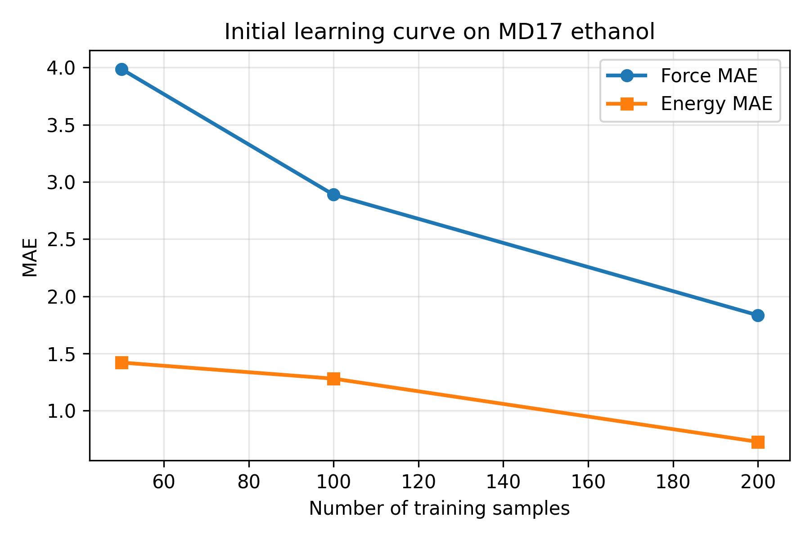

# SchNet Reproduction on MD17 Ethanol

This project reproduces a small-scale machine learning force field experiment using SchNetPack on the MD17 ethanol dataset.

The goal is to show that a neural network potential can learn molecular energies and atomic forces from reference molecular dynamics data, and that prediction accuracy improves as the number of training samples increases.

## Project Status

Current milestone: initial learning curve completed.

- Environment setup completed
- GPU-enabled PyTorch installed
- SchNetPack training pipeline verified
- MD17 ethanol subset prepared
- Smoke test completed
- Learning curve experiments completed for 50, 100, 200, 500, and 1000 training samples

## Dataset

Dataset: MD17 ethanol  
Subset used: 10,000 evenly spaced molecular configurations  
Properties: energy and atomic forces  
Model input: atomic numbers and atomic positions  
Model output: molecular energy and atomic forces

The local training database is not uploaded to GitHub because dataset files can be large.

## Model

The experiments use the default MD17 experiment configuration from SchNetPack.

Model family: SchNet neural network potential  
Framework: PyTorch + SchNetPack  
GPU: NVIDIA GeForce RTX 3060 Laptop GPU

## Learning Curve Results

All runs used:

- Validation samples: 100
- Test samples: 500
- Epochs: 10
- DataLoader workers: 0

| n_train | epochs | test_energy_mae | test_energy_rmse | test_forces_mae | test_forces_rmse | test_loss |
|---:|---:|---:|---:|---:|---:|---:|
| 50 | 10 | 1.4213 | 1.8579 | 3.9876 | 5.4217 | 29.1350 |
| 100 | 10 | 1.2807 | 1.5965 | 2.8884 | 3.9451 | 15.4340 |
| 200 | 10 | 0.7284 | 0.9285 | 1.8346 | 2.5614 | 6.5036 |
| 500 | 10 | 0.3721 | 0.4705 | 1.1501 | 1.5839 | 2.4858 |
| 1000 | 10 | 0.2563 | 0.3370 | 0.7925 | 1.1134 | 1.2285 |

## Learning Curve



The force MAE decreases as the number of training samples increases. This shows that the SchNet model learns a better molecular force field from more reference data.

## How To Run

Activate the environment:

```bat
conda activate mlff
cd /d D:\everything_about_coding\schnet-rMD17-ethanol-ff-reproduction
set PWD=%CD%
```

Example training command:

```bat
python "%CONDA_PREFIX%\Scripts\spktrain" experiment=md17 data.molecule=ethanol data.num_train=1000 data.num_val=100 data.num_test=500 data.num_workers=0 data.num_val_workers=0 data.num_test_workers=0 trainer.max_epochs=10 run.id=lc_train1000_epoch10
```

Plot the learning curve:

```bat
python scripts\plot_initial_learning_curve.py
```

## Notes

The automatic MD17 download in SchNetPack was unstable on this machine, so a local 10k-frame ethanol database was prepared from the original MD17 ethanol data.

On Windows, `data.num_workers=0` was used to avoid DataLoader worker crashes.

## Next Steps

- Run longer training experiments
- Compare SchNet with PaiNN or another neural potential
- Use revised MD17 if available in the local workflow
- Add a short molecular dynamics stability test
